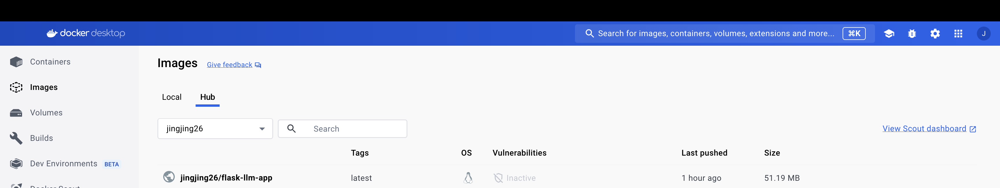
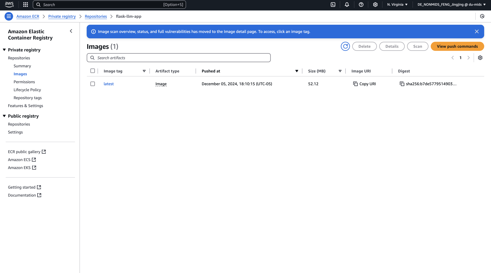
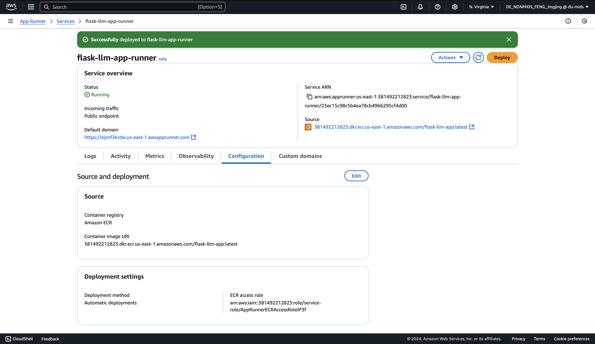
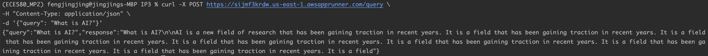

# jf361_ids706_ip3
[](https://github.com/siyiia/jf361_ids706_ip3/actions/workflows/cicd.yml)

### Video Link
[Watch the video here]()

## Project Introduction
This project is to build a publicly accessible auto-scaling container using AWS Services and Flask

## Project Description
This project implements a Flask-based web application that interfaces with the Hugging Face Inference API to perform text generation.

## Project Setup
1. Implement the Flask app using Python
2. Build the Docker Image and test the image function
   ```
   docker build -t <app_name> .
   docker run -p <PORT_NUMBER>:<PORT_NUMBER> <app_name>
   ```
3. Push Docker Image to DockerHub (via GitHub CI)
   ```
   docker push <your_dockerhub_username>/<app_name>
   ```
4. Pull from DockHub, create a repository in AWS ECR and push image to this repository
   ```
   # pull image from DokerHub
   docker pull <your_dockerhub_username>/<app_name>
   
   # Login to AWS
   aws ecr get-login-password --region <region> | docker login --username AWS --password-stdin <aws_account_id>.dkr.ecr.<region>.amazonaws.com
   
   # Push image to 
   docker tag <your_dockerhub_username>/<app_name> <aws_account_id>.dkr.ecr.<region>.amazonaws.com/<app_name>
   docker push <aws_account_id>.dkr.ecr.<region>.amazonaws.com/<app_name>
   ```
5. Use AWS App Runner to deploy container.
   1. Under `AWS App Runner` console, click `create service` and choose the repository created in step 4
   2. After create the service, under `Configuration->Configure service`, add necessary `Runtime environment variables`
   3. `Deploy` the service
6. Test the function of App
   ```
   curl -X POST <HTTP_PATH>/query \
   -H "Content-Type: application/json" \
   -d '{"query": "What is AI?"}'
   ```
### Screenshots
##### Successfully Push Docker image to Docker Hub from GitHub CI


#### Successfully Push Docker image to AWS ECR


##### Successfully Deploy Container


##### Test the function of Web App


